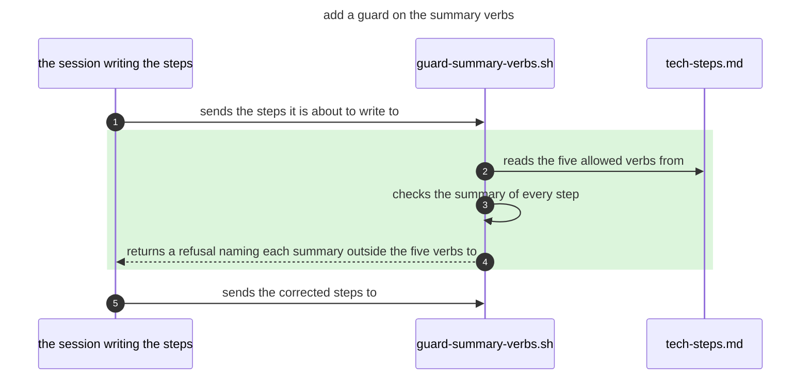

# Implementation steps

How a piece of work is built, written down before it is. The output goes to `.tech-steps/<name>.md`, where `<name>` is what the work does, in lower case with hyphens for spaces - `.tech-steps/add-a-guard-on-the-summary-verbs.md`. One file per piece of work.

The file holds two sections and no others:

```
## Tech Steps
## Details
```

Never add `## Risks`, `## Complexity`, `## Implementation Notes`, or any other heading. Complexity goes inside `## Details`.

## Tech Steps

### The file tree

A diff code block opens the section: the file tree the steps touch, each file marked `+` new, `-` removed or `!` edited, then one sentence of what it needs - the step summary above its `In <path>` toggle is that sentence. Directory lines carry a leading space, so the markers line up and the tree stays aligned.

Every file line is joined to the folder above it: `├── ` when another entry follows it in that folder, `└── ` when it is the last, and a folder with entries still to come carries `│` down the column its own join sat in. A file line reaching its name on indentation alone is refused.

One tree per thing the work does, each headed by what it does, centred in a 120 character rule of `=`. Work doing one thing has one tree, and it carries that heading too. One line per file, however many changes that file takes - the step toggles below carry them one by one. A path appears once in its tree. A file two trees both touch appears in both, carrying the sentence for that tree only. Every sentence in a tree starts at the same column, two spaces past the longest path line in that tree.

```diff
=========================================== add a guard on the summary verbs ===========================================
  rules/
! └── tech-steps.md                add the five verbs a summary may open on
  hooks/
+ └── guard-summary-verbs.sh       add a check refusing a summary that opens on another verb
  tests/
+ └── test-guard-summary-verbs.sh  add one case for each allowed verb and one outside them
```

### The sequence flow

Below the tree sits a sequence flow, drawn only when the change spans more than one call: one lane per file the change runs through, the calls between them in order, and what each returns. The tree is a `diff` block, the sequence flow a `mermaid` one carrying `title` and `autonumber`. Both sit above the first layer toggle, tree first.

A `rect` shading a run of calls carries the tree's meaning: green `rgb(220, 245, 220)` for a call the change adds, red `rgb(255, 225, 225)` for one it removes, and no shading for one that already happens and about which nothing has changed. A call that changes is drawn twice - the old one red, above the new one in green. `autonumber 1` between them resets the counter.

The flow carries the call immediately before the shaded run and the one immediately after, unshaded.

Each arrow's label is the middle of a sentence - the sender, the label, then the receiver - so `sends the drafted steps to` between `the session writing the steps` and `guard-summary-verbs.sh` reads as one line. A call a participant makes to itself has no receiver to append, so its label is the whole predicate.

A lane is named for what it is - a file by its name, anything else by a plain noun phrase, as in `the session writing the steps`. Lanes run left to right in call depth: the trigger on the left - the user when the change has one - then each lane the calls descend into, ending at the lowest level the change reaches. One flow per thing the work does, matching the trees. Every tree sits in one `diff` block, and each thing's flow in its own `mermaid` block below it, in the order the trees are in.



### The verb a summary opens on

Every step, change and `In <path>` summary opens on one of five verbs: `add`, `replace`, `remove`, `rename`, `move`. Two rules on what follows:

1. **Name the thing.** "name what holds the key" names nothing - say which declaration in which file.
2. **No `so ...` clause.** The summary says what the change does, never why it was wanted.

`guard-tech-steps.sh` refuses a write that breaks either of these, or any rule above about how the tree and the flow are built. Whether a summary names the thing, whether an arrow label reads as a sentence, whether the lanes run in call depth and whether the right calls are drawn are not machine-checkable and stay rules here.

### The steps

Implementation steps structured as nested toggles, organized by layer, concern, and intent. Every individual change gets its own toggle: the summary carries the intent, the body carries the code.

````
## Tech Steps
<details>
<summary>FE Layer **(3 points)**</summary>
	<details>
	<summary>[data] add a cached query hook for the user profile</summary>
		<details>
		<summary>In src/hooks/useUserProfile.ts - add one query hook cached under a stable key</summary>
			```ts
			export const useUserProfile = (): UseQueryResult<UserProfile> =>
			  useQuery({ queryKey: ['user', 'profile'], queryFn: getUserProfile });
			```
		</details>
	</details>
	<details>
	<summary>[ui] replace the profile query call in the settings form</summary>
		<details>
		<summary>In src/components/ProfileForm.tsx</summary>
			<details>
			<summary>replace the query call with one that holds a dirty form through a refetch</summary>
				```diff
				-  const { data } = useUserProfile();
				+  const { data } = useUserProfile({ refetchOnWindowFocus: false });
				```
			</details>
			<details>
			<summary>add an error branch to the submit handler</summary>
				```diff
				   const onSubmit = async (values: ProfileValues) => {
				     ...
				-    await updateProfile(values);
				+    const result = await updateProfile(values);
				+    if (result instanceof Error) setError(result.message);
				   };
				```
			</details>
			- replace the form's snapshot test fixture (output is a fixture, cannot be shown here)
		</details>
	</details>
</details>
````

Format rules:

1. Top-level toggles are **layers**, picked from the fixed set below - never invented to fit a piece of work. A layer is a distinct execution context; the test is _who or what runs this?_ Two things run by the same thing in the same way are one layer, not two.

   | Layer     | Who runs it                                         |
   | --------- | --------------------------------------------------- |
   | `FE`      | the browser or RN runtime                           |
   | `BE`      | the server                                          |
   | `Native`  | the OS directly - iOS/Android, bridge, manifests    |
   | `Infra`   | the cloud provider or CI                            |
   | `Testing` | CI, against product code                            |
   | `Tooling` | the user's shell - scripts, aliases, local commands |
   | `Agent`   | the agent or its harness                            |
   | `Docs`    | a human reading them                                |

   The toggle summary is the layer name followed by the word `Layer` - `Agent Layer`, `FE Layer`, `Docs Layer`.

   If a change genuinely fits none of these, name a new layer and add it to this table in the same commit - never leave it as a one-off label.

2. Second-level toggles are **concerns**, picked from the fixed set for that layer. A layer with no entry below has no concern level - and no `[concern]` prefix either. Never invent a concern to fill the slot.

   | Layer                       | Concerns                                                            |
   | --------------------------- | ------------------------------------------------------------------- |
   | `FE`                        | `data`, `ui`, `state`, `routing`                                    |
   | `BE`                        | `routes`, `middleware`, `services`, `persistence`, `jobs`, `auth`   |
   | `Infra`                     | `networking`, `iam`, `storage`, `ci`                                |
   | `Testing`                   | `unit`, `integration`, `e2e`                                        |
   | `Agent`                     | `skills`, `instructions`, `hooks`, `settings`, `scripts`, `testing` |
   | `Native`, `Tooling`, `Docs` | none - the layer is already the division                            |

   A concern toggle's summary is the concern in square brackets - `[skills]`, `[ui]` - never bare.

   When a layer has concerns but one of them holds a single step, drop the concern toggle and prefix the step summary with the same bracketed form, e.g. `[ui] let the user edit their profile`, so collapsed and expanded concerns read alike. A concern outside this table means adding it to the table in the same commit - never a one-off label.

3. Step toggles explain **why** (the purpose/intent) in the summary. The toggle body contains the **what**: the `In <path>` toggles, and bullets for any change that cannot be shown as code. Never leave a toggle body empty.
   - **The summary names what the change achieves, never the defect it removes.** "nothing names the shape that fails the rule" proposes leaving that gap in place, and a reviewer reads it as an argument for the defect; "name the shape that fails the rule" says what the step delivers. Write the state the step brings about.
4. **One toggle per change, never a wall** - inside `In <path>`, each individual change gets its own toggle: summary is the intent, body is a single code block.
   - **Never stack changes into one block.** Two edits to the same file are two toggles. No `@@` hunk headers - the summary is the header.
   - **A file with exactly one change collapses**: the `In <path>` toggle holds the block directly and its summary carries the intent, e.g. `In src/hooks/useUserProfile.ts - add one query hook cached under a stable key`.
   - **Edits** use a `diff` block; **new files** use a block in the file's own language showing what defines it - signature, exported shape, or the whole body when under ~10 lines.
   - **Elide down to the decisions**, the `+` side included. Keep the line's `-`, `+` or context marker, put `...` on its own line, and name what was dropped - `... (2 sub-bullets: exact values; create/update prefix)`. Wording is the implementer's job; every line someone could say no to stays in full.
   - **After-text that cannot be known yet** stays inside the block as a single `+` line, never as prose beside it.
   - **Changes with nothing showable** - one that is itself a code fence, which cannot nest - stay as plain bullets under the toggles.
   - **Many changes group.** When an `In <path>` toggle would hold more than five change toggles, add a level between them: toggles named for the theme their changes share (the point rules / the output format / the gates). These are free-form groupings within one file, not concerns from rule 2.
5. **Shared paths nest** - when multiple changes share a parent directory, group them under an `In path/` toggle instead of repeating the full path on each item. When the toggle covers more than one file, each change toggle's summary names its file, e.g. `useUserProfile.ts - add the cached profile query`.
6. Omit layers that have no steps - never show an empty layer toggle.
7. No numbered items inside toggles.
8. List direct dependencies only.
9. **Every layer carries its estimate** - each top-level layer summary ends with a bold point figure in round brackets: `Agent Layer **(2 points)**`, `Docs Layer **(1 point)**`. Singular `point` at 1, plural above. Only top-level layers carry points - concern, step and change toggles never do.

## Details

`## Details` holds Complexity. If the section already exists, append to it rather than replacing.

**Complexity** - a Fibonacci estimate with rationale and reference comparison. The scale is `1`, `2`, `3`, `5`, `8`, `13`, `21`.

Output format - a toggle whose summary carries the arithmetic:

```
<details>
<summary>Complexity Breakdown: 3 = FE 2 + Testing 1</summary>
	**FE 2** - matches [reference name]: [why]
	**Testing 1** - matches [reference name]: [why]
</details>
```

Estimation procedure:

1. Read the reference anchors. These rules carry none - whoever calls them supplies the set of already-sized work each level is anchored to.
2. Compare each layer's scope (number of files, conceptual difficulty, blast radius) against the anchors at each Fibonacci level - never the whole piece of work at once.
3. Sum the layer points. The per-layer breakdown is the rationale; no independent whole-of-work figure is proposed.
4. A sum landing off the Fibonacci scale rounds up to the next value on it - 4 rounds to 5, 7 rounds to 8. Never down.
5. With no anchors on hand, estimate without them and say the reference comparison was skipped.
6. The proposed value is a suggestion; the human adjusts it.
